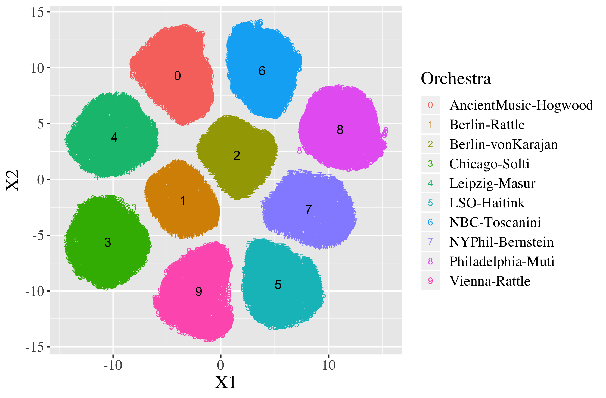

My current research projects focus broadly on probabilistic modeling for complex time series, with applications for audio data and retail demand forecasting.  I am particularly interested in developing models that accurately represent uncertainty and capture hierarchical structure in complex data settings.

## Hierarchical Multidimensional Scaling

- A.K. Yanchenko and P.D. Hoff. **Hierarchical Multidimensional Scaling for the Comparison of Musical Performance Styles.** *Annals of Applied Statistics*, to appear, 2020. [[arXiv](https://arxiv.org/abs/2004.13870) \| [code](https://github.com/aky4wn/HMDS)]

## Personalized Forecasting

- A.K. Yanchenko, D. Deng, C. Li, A.J. Cron and M. West. **Probabilistic hierarchical dynamic modelling for individualized forecasting.** *Technical Report, Department of Statistical Science, Duke University.* (to be submitted shortly) 2020.

## Stanza

- A.K. Yanchenko and S. Mukherjee. **Stanza: A Nonlinear State Space Model for Probabilistic Inference in Non-Stationary Time Series.** 2020. [[arXiv](https://arxiv.org/abs/2006.06553)]

## Audio Representation Learning

Representation learning for audio signals is a challenging task, especially for complex signals arising from orchestral classical music.  This ongoing project looks to extend preliminary findings in the [Symphony2Vec](https://aky4wn.github.io/code/) project to learn a meaningful, disentangled latent representation for complex audio with known long term structure.

# Algorithmic Composition

One of my long-term research goals is the generative modeling of classical, orchestral music. The successful modeling of orchestral classical music is an important challenge with applications to many disciplines.  Orchestral classical music is a complex, multivariate time series that is highly structured, both temporally (in terms of melody) and vertically (in terms of harmony).  There are complex dependencies between different instruments, and thus there is a high level of structure both within the part of a single instrument and between instruments.  Music is a long-memory process, with long-term structure over multiple minutes in full orchestral works.  Additionally, the modeling of music is challenging from a data perspective, as there is very little labeled data and it is expensive to obtain, necessitating unsupervised approaches.  Audio data, in particular, while of high interest, is challenging to annotate and label in its raw form. However, music theory provides a source of *ground truth* to assess and validate results.

- A.K. Yanchenko and S. Mukherjee. **Classical Music Composition Using State Space Models.** 2018.  [[arXiv](https://arxiv.org/abs/1708.03822) \| [website](https://aky4wn.github.io/Classical-Music-Composition-Using-State-Space-Models/) \| [code](https://github.com/aky4wn/Classical-Music-Composition-Using-State-Space-Models)]

